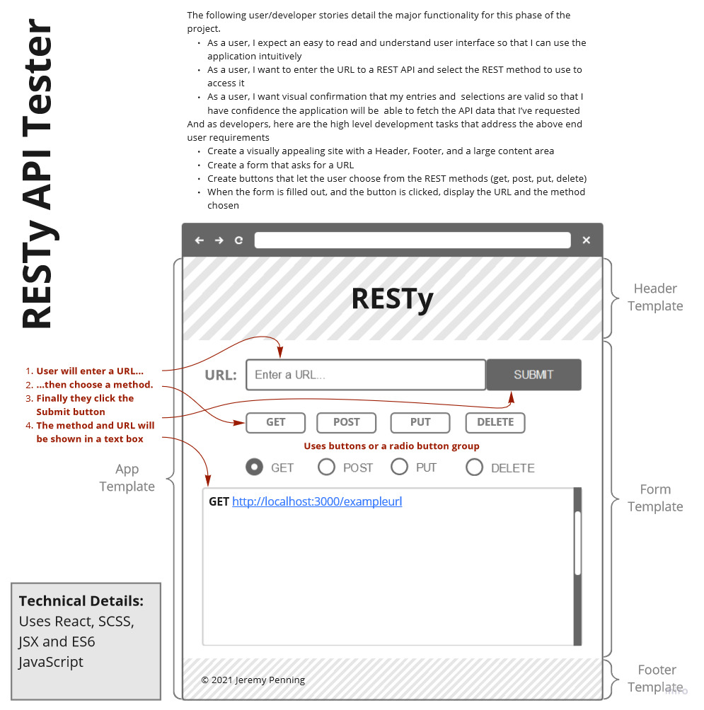

# LAB - Class 26

## Project: RESTy

### Author: Jeremy Penning

### Links and Resources

- [Heroku Deployment](https://jeremyp-resty.herokuapp.com)

---

### Setup

#### How to initialize/run the application

To run application:

`npm start`

#### Tests

(There are no testing requirements for this project.)

### Whiteboard / UML

